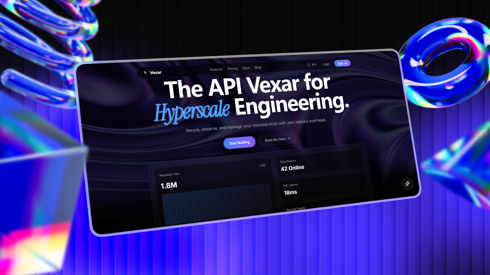

# Vexar - SaaS Landing Page

<div align="center">

**English** | [简体中文](./README.zh-CN.md)

</div>

<div align="center">


A modern, high-performance SaaS landing page for the Vexar platform featuring 3D card interactions, smooth animations, and glassmorphism design.

[Live Demo](#) · [Report Bug](#) · [Request Feature](#)



</div>

---

## ✨ Features

### 🎨 Design & UI
- **Glassmorphism Design** - Ultra-modern glass-effect UI with backdrop blur
- **3D Card Stack** - Interactive fan-style card layout with perspective transforms
- **Smooth Animations** - Powered by Framer Motion with spring physics
- **Dark Theme** - Pure black aesthetic with blue/purple accents
- **Responsive Design** - Mobile-first approach with breakpoint optimization

### 🚀 Performance
- **Vite Build System** - Lightning-fast HMR and optimized production builds
- **Code Splitting** - Automatic route-based code splitting
- **Lazy Loading** - Images and components loaded on demand
- **Optimized Assets** - Compressed and cached static resources

### 🛠️ Developer Experience
- **TypeScript** - Full type safety across the codebase
- **ESLint** - Consistent code style and quality
- **Hot Module Replacement** - Instant feedback during development
- **Component Library** - Reusable UI components in `/components/ui`

---

## 📦 Tech Stack

| Category | Technology |
|----------|-----------|
| **Framework** | React 19.2 |
| **Language** | TypeScript 5.9 |
| **Build Tool** | Vite 7.3 |
| **Styling** | Tailwind CSS 4.1 |
| **Animation** | Framer Motion 12.34 |
| **Routing** | React Router 7.13 |
| **Icons** | Lucide React |
| **Utilities** | clsx, tailwind-merge |

---

## 🚀 Quick Start

### Prerequisites

- Node.js 20.19+ or 22.12+
- npm or yarn or pnpm

### Installation

```bash
# Clone the repository
git clone https://github.com/moli721/gateway-hyperscale-saas.git
cd gateway-hyperscale-saas

# Install dependencies
npm install

# Start development server
npm run dev
```

The application will be available at `http://localhost:5173`

### Build for Production

```bash
# Build the project
npm run build

# Preview production build
npm run preview
```

---

## 📁 Project Structure

```
v0-project/
├── src/
│   ├── components/          # Reusable components
│   │   ├── ui/             # UI component library
│   │   │   └── card-stack.tsx
│   │   ├── FloatingAIChat.tsx
│   │   ├── Footer.tsx
│   │   ├── Navbar.tsx
│   │   └── SearchModal.tsx
│   ├── pages/              # Route pages
│   │   ├── Homepage.tsx
│   │   ├── PricingPage.tsx
│   │   └── DocsPage.tsx
│   ├── lib/                # Utility functions
│   │   └── utils.ts
│   ├── App.tsx             # Root component
│   ├── main.tsx            # Entry point
│   └── index.css           # Global styles
├── public/                 # Static assets
├── tailwind.config.js      # Tailwind configuration
├── tsconfig.json           # TypeScript configuration
├── vite.config.ts          # Vite configuration
└── package.json
```

---

## 🎨 Key Components

### CardStack Component
Interactive 3D card stack with fan-style layout:
- Drag-to-navigate functionality
- Keyboard navigation (Arrow keys)
- Auto-advance mode
- Customizable perspective and depth
- Spring-based animations

```tsx
<CardStack
  items={features}
  cardWidth={480}
  cardHeight={320}
  overlap={0.6}
  spreadDeg={38}
  loop={true}
  showDots={true}
/>
```

### Design System
- **Colors**: Pure black backgrounds with blue/purple accents
- **Typography**: Inter (body), Instrument Serif (emphasis), SF Pro Display (headings)
- **Spacing**: Consistent 8px grid system
- **Borders**: Ultra-thin white borders with low opacity
- **Shadows**: Layered shadows for depth perception

---

## 🎯 Available Scripts

| Command | Description |
|---------|-------------|
| `npm run dev` | Start development server with HMR |
| `npm run build` | Build for production |
| `npm run preview` | Preview production build locally |
| `npm run lint` | Run ESLint for code quality |

---

## 🌐 Browser Support

- Chrome/Edge (latest 2 versions)
- Firefox (latest 2 versions)
- Safari (latest 2 versions)
- Mobile browsers (iOS Safari, Chrome Mobile)

---

## 📝 Configuration

### Tailwind CSS
Custom color palette and design tokens in `tailwind.config.js`:
- Background colors (absolute black, deep charcoal)
- Accent colors (electric blue, vivid purple)
- Text colors with opacity variants
- Custom font families and animations

### TypeScript
Strict mode enabled with:
- `verbatimModuleSyntax` for type imports
- Path aliases configured
- React JSX transform

---

## 🤝 Contributing

Contributions are welcome! Please follow these steps:

1. Fork the repository
2. Create a feature branch (`git checkout -b feature/amazing-feature`)
3. Commit your changes (`git commit -m 'feat: add amazing feature'`)
4. Push to the branch (`git push origin feature/amazing-feature`)
5. Open a Pull Request

### Commit Convention
Follow [Conventional Commits](https://www.conventionalcommits.org/):
- `feat:` New features
- `fix:` Bug fixes
- `docs:` Documentation changes
- `style:` Code style changes
- `refactor:` Code refactoring
- `perf:` Performance improvements
- `test:` Test updates
- `chore:` Build/tooling changes

---

## 📄 License

This project is private and proprietary.

---

## 🙏 Acknowledgments

- [React](https://react.dev/) - UI framework
- [Vite](https://vitejs.dev/) - Build tool
- [Tailwind CSS](https://tailwindcss.com/) - Utility-first CSS
- [Framer Motion](https://www.framer.com/motion/) - Animation library
- [Lucide](https://lucide.dev/) - Icon library

---

<div align="center">

**Built with ❤️ using modern web technologies**

</div>
